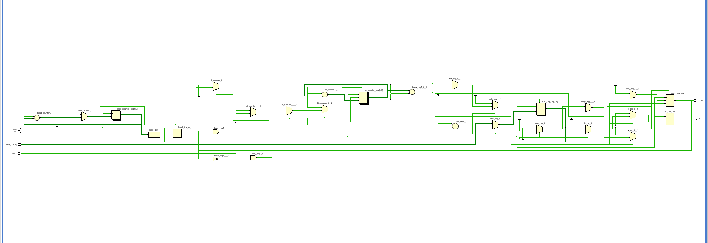
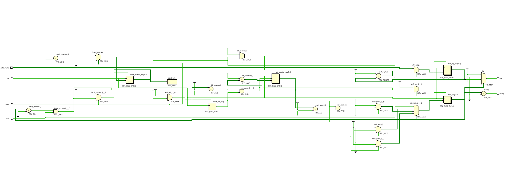
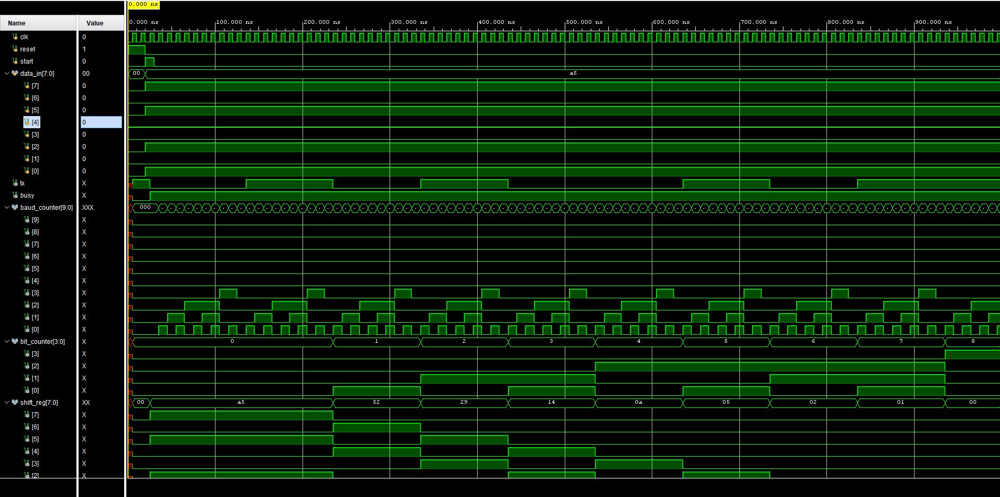

# UART Transmitter — Verilog

A parameterized UART transmitter designed in Verilog and verified using simulation in Xilinx Vivado.

## Overview

This project implements an 8-bit UART transmitter using a finite state machine (FSM).

The transmitter generates a standard UART frame consisting of:

- 1 start bit
- 8 data bits
- 1 stop bit
- No parity bit
- LSB-first data transmission

A UART receiver (RX) implementation has also been added to the project along with its RTL schematic.

## UART Configuration

### RTL Default Configuration

- Clock frequency: **100 MHz**
- Baud rate: **115200**
- Data bits: **8**
- Start bits: **1**
- Stop bits: **1**
- Parity: **None**
- Data order: **LSB first**

### Testbench Configuration

For faster simulation, the testbench uses:

- `CLK_FREQ = 100`
- `BAUD_RATE = 10`
- `BAUD_COUNT = 10 clock cycles per bit`

Test data:

```text
10100101
```

Since UART transmits the least significant bit first, the data bits are transmitted in this order:

```text
1 → 0 → 1 → 0 → 0 → 1 → 0 → 1
```

## UART Frame Format

```text
Idle | Start | D0 | D1 | D2 | D3 | D4 | D5 | D6 | D7 | Stop
  1     0     LSB                         MSB       1
```

The TX line is normally HIGH when idle.

When transmission starts, the transmitter sends a LOW start bit, followed by the eight data bits, and finally a HIGH stop bit.

## FSM Architecture

The transmitter uses four states:

```text
        start
IDLE ----------> START
 ^                |
 |             baud_tick
 |                v
 |               DATA
 |                |
 |             last bit
 |                v
 +--------------- STOP
       baud_tick
```

### States

#### IDLE

- TX remains HIGH.
- The transmitter waits for `start`.
- `busy = 0`.

#### START

- TX is LOW.
- This represents the UART start bit.
- The state lasts for one baud period.

#### DATA

- Eight data bits are transmitted.
- Data is transmitted LSB first.
- The shift register shifts right after each baud tick.
- `bit_counter` tracks the transmitted bits.

#### STOP

- TX is HIGH.
- This represents the UART stop bit.
- After one baud period, the transmitter returns to `IDLE`.

## RTL Schematic

The following schematic shows the RTL structure of the UART transmitter, including the FSM, baud-rate counter, bit counter, and shift register.



## UART Receiver (RX)

The project also includes an 8-bit UART receiver implementation.

The receiver RTL is provided in:

```text
uart_rx.v
```

The corresponding RTL schematic is shown below:



## Simulation

The transmitter was verified using a dedicated Verilog testbench.

The testbench:

1. Applies reset.
2. Loads the test byte `10100101`.
3. Generates a `start` pulse.
4. Allows the UART transmitter to serialize the byte.
5. Observes the TX waveform and internal signals.

### Signals Observed

- `clk`
- `reset`
- `start`
- `data_in`
- `tx`
- `busy`
- `baud_counter`
- `bit_counter`
- `shift_reg`
- `baud_tick`

## Simulation Waveform

The simulation waveform demonstrates the complete UART transmission sequence.



The waveform verifies:

- Start request
- `busy` assertion
- Start bit
- Eight data bits
- LSB-first transmission
- Baud tick generation
- Shift-register operation
- Bit counter progression
- Stop bit
- Return to idle

## Project Structure

```text
uart-tx-verilog/
│
├── uart_tx.v
├── uart_tx_tb.v
├── uart_tx_Schematic.png
├── uart_tx_tb_waveform.png
│
├── uart_rx.v
├── uart_rx_Schematic.png
│
└── README.md
```

### File Description

| File | Description |
|---|---|
| `uart_tx.v` | UART transmitter RTL |
| `uart_tx_tb.v` | UART transmitter simulation testbench |
| `uart_tx_Schematic.png` | UART transmitter RTL schematic |
| `uart_tx_tb_waveform.png` | UART transmitter simulation waveform |
| `uart_rx.v` | UART receiver RTL |
| `uart_rx_Schematic.png` | UART receiver RTL schematic |
| `README.md` | Project documentation |

## Design Parameters

The UART transmitter is parameterized so the clock frequency and baud rate can be changed:

```verilog
parameter CLK_FREQ = 100_000_000;
parameter BAUD_RATE = 115200;

localparam BAUD_COUNT = CLK_FREQ / BAUD_RATE;
```

This allows the same RTL module to be adapted to different clock and baud-rate configurations.

## Tools Used

- **Verilog HDL**
- **Xilinx Vivado**
- **Vivado Simulator**
- **Git / GitHub**

## Future Work

- UART Receiver (RX) verification
- Combined UART TX/RX module
- Loopback testing
- FPGA hardware verification
- Improved baud-rate generation with fractional error correction
