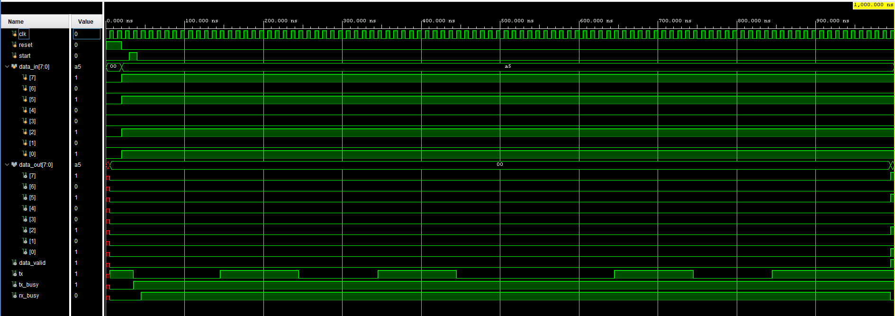

# UART Transmitter & Receiver --- Verilog

A parameterized UART transmitter and receiver designed in Verilog and
verified using simulation in Xilinx Vivado.

## Overview

This project implements an 8-bit UART communication system using Verilog
HDL.

The project contains:

-   UART Transmitter (TX)
-   UART Receiver (RX)
-   TX/RX loopback integration
-   Parameterized clock and baud-rate configuration
-   FSM-based UART transmission and reception
-   Self-checking simulation testbenches
-   Multi-byte loopback verification

The UART uses the standard **8N1** configuration:

-   1 start bit
-   8 data bits
-   No parity bit
-   1 stop bit
-   LSB-first data transmission

## UART Configuration

### RTL Default Configuration

-   Clock frequency: **100 MHz**
-   Baud rate: **115200**
-   Data bits: **8**
-   Start bits: **1**
-   Stop bits: **1**
-   Parity: **None**
-   Data order: **LSB first**

The baud-rate divider is parameterized:

``` verilog
parameter CLK_FREQ = 100_000_000;
parameter BAUD_RATE = 115200;

localparam BAUD_COUNT = CLK_FREQ / BAUD_RATE;
```

This allows the same RTL to be adapted to different clock frequencies
and baud rates.

### Testbench Configuration

For faster simulation, the loopback testbench uses:

``` verilog
.CLK_FREQ(1_000_000),
.BAUD_RATE(100_000)
```

Therefore:

``` text
BAUD_COUNT = 1,000,000 / 100,000
           = 10 clock cycles per bit
```

The testbench verifies multiple data patterns:

``` text
A5 = 1010 0101
3C = 0011 1100
F0 = 1111 0000
55 = 0101 0101
```

## UART Frame Format

The UART frame follows the standard 8N1 format:

``` text
Idle | Start | D0 | D1 | D2 | D3 | D4 | D5 | D6 | D7 | Stop
  1     0     LSB                         MSB       1
```

The TX line is normally **HIGH** when idle.

When transmission starts:

1.  A LOW start bit is transmitted.
2.  Eight data bits are transmitted LSB first.
3.  A HIGH stop bit is transmitted.
4.  The transmitter returns to the idle state.

## UART Transmitter (TX)

The transmitter is implemented using a four-state finite state machine.

``` text
        start
IDLE ----------> START
 ^                |
 |             baud_tick
 |                v
 |               DATA
 |                |
 |             last bit
 |                v
 +--------------- STOP
       baud_tick
```

### TX States

#### IDLE

-   TX remains HIGH.
-   The transmitter waits for `start`.
-   `busy = 0`.

#### START

-   TX is LOW.
-   This represents the UART start bit.
-   The state lasts for one baud period.

#### DATA

-   Eight data bits are transmitted.
-   Data is transmitted LSB first.
-   The shift register shifts right after each baud tick.
-   `bit_counter` tracks the transmitted bits.

#### STOP

-   TX is HIGH.
-   This represents the UART stop bit.
-   After one baud period, the transmitter returns to `IDLE`.

## TX RTL Schematic


## UART Receiver (RX)

The project also includes an 8-bit UART receiver.

The receiver detects the falling edge of the start bit and then samples
the incoming serial data at the center of each bit period.

The receiver uses:

-   Baud-rate counter
-   Half-baud timing for start-bit validation
-   Bit counter
-   Shift register
-   FSM
-   `data_valid` indication

The receiver verifies the start bit before entering the data reception
state.

After receiving eight data bits, the receiver checks the stop bit. If
the stop bit is HIGH, the received byte is transferred to `data_out` and
`data_valid` is asserted.

The receiver RTL is provided in:

``` text
uart_rx.v
```

### RX RTL Schematic


## UART TX/RX Loopback

A loopback module was added to connect the UART transmitter directly to
the UART receiver.

The architecture is:

``` text
        ┌─────────────┐
        │ UART TX     │
        │             │
data_in ─►             │
        │             │
        └──────┬──────┘
               │
               │ serial_line
               │
        ┌──────▼──────┐
        │ UART RX     │
        │             │
        │             ├──► data_out
        │             │
        └─────────────┘
```

The loopback module provides:

-   TX output
-   TX busy status
-   RX busy status
-   RX data output
-   RX `data_valid` signal

The TX and RX modules share the same clock-frequency and baud-rate
parameters.

## Simulation and Verification

The UART system was verified using Verilog testbenches in Vivado
Simulator.

The loopback testbench uses a reusable Verilog task:

``` verilog
task send_byte(input [7:0] expected_data);
```

The task automates the complete test sequence:

1.  Wait until the transmitter is idle.
2.  Load the test byte into `data_in`.
3.  Generate the `start` pulse.
4.  Wait for the receiver to assert `data_valid`.
5.  Compare the received byte with the expected byte.
6.  Display a PASS or FAIL result.

The testbench uses:

``` verilog
wait(tx_busy == 0);
```

to ensure that a new byte is not started while the transmitter is still
busy.

It then waits for:

``` verilog
wait(data_valid == 1);
```

before checking the received data.

## Loopback Verification Results

The following byte patterns were tested:

``` text
A5
3C
F0
55
```

The Vivado simulation produced:

``` text
PASS: Expected = a5, Received = a5
PASS: Expected = 3c, Received = 3c
PASS: Expected = f0, Received = f0
PASS: Expected = 55, Received = 55
```

This verifies that the transmitted data successfully travels through the
loopback path:

``` text
TX → serial_line → RX → data_out
```

## Loopback Simulation Waveform

The waveform below shows the multi-byte TX/RX loopback simulation.



The waveform demonstrates:

-   Multiple transmitted bytes
-   `data_in` changing between test bytes
-   TX activity on the serial line
-   `tx_busy` assertion during transmission
-   RX activity
-   `data_out` receiving the transmitted bytes
-   `data_valid` assertion after successful reception

The tested sequence is:

``` text
A5 → 3C → F0 → 55
```

with the received data following the same sequence.

## Signals Observed

The simulation includes the following signals:

-   `clk`
-   `reset`
-   `start`
-   `data_in`
-   `data_out`
-   `data_valid`
-   `tx`
-   `tx_busy`
-   `rx_busy`

Internal UART signals such as the baud-rate counter, bit counter, shift
register, and FSM state can also be inspected during simulation.

## Project Structure

``` text
uart-tx-verilog/
│
├── uart_tx.v
├── uart_tx_tb.v
├── uart_tx_Schematic.png
├── uart_tx_tb_waveform.png
│
├── uart_rx.v
├── uart_rx_Schematic.png
├── uart_rx_tb_waveform.png
│
├── uart_loopback.v
├── uart_loopback_tb.v
├── uart_loopback_tb.png
│
└── README.md
```

### File Description

  File                        Description
  --------------------------- ----------------------------------------
  `uart_tx.v`                 UART transmitter RTL
  `uart_tx_tb.v`              UART transmitter simulation testbench
  `uart_tx_Schematic.png`     UART transmitter RTL schematic
  `uart_tx_tb_waveform.png`   UART transmitter simulation waveform
  `uart_rx.v`                 UART receiver RTL
  `uart_rx_Schematic.png`     UART receiver RTL schematic
  `uart_rx_tb_waveform.png`   UART receiver simulation waveform
  `uart_loopback.v`           TX/RX loopback integration module
  `uart_loopback_tb.v`        Self-checking TX/RX loopback testbench
  `uart_loopback_tb.png`      TX/RX loopback simulation waveform
  `README.md`                 Project documentation

## Design Parameters

Both UART TX and RX are parameterized using clock frequency and baud
rate:

``` verilog
parameter CLK_FREQ = 100_000_000;
parameter BAUD_RATE = 115200;

localparam BAUD_COUNT = CLK_FREQ / BAUD_RATE;
```

This allows the UART modules to be reused with different system clock
and baud-rate configurations.

## Tools Used

-   **Verilog HDL**
-   **Xilinx Vivado 2025.2**
-   **Vivado Simulator**
-   **Git / GitHub**

## Future Work

-   Test reset during an active transmission
-   Test `start` requests while TX is busy
-   Add additional edge-case and randomized verification
-   Improve baud-rate generation with fractional error correction
-   FPGA hardware verification
